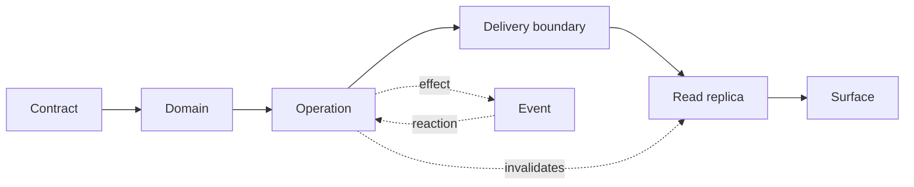

# Architecture Constitution

> **Purpose.** This skill defines the law that survives a stack swap.
> `turystack-backend-pattern` and `turystack-frontend-pattern` define how to
> write it in each stack. The `@turystack/*` libs are the source of truth for
> setup, options and public API. Nothing here replicates any of the three.

**Rules defined here:** none — every rule this file states is defined
elsewhere and cited by id.

## Mental model



- **Contract** is the source of truth for types. Everything derives from it;
  nothing duplicates it.
- **Domain** protects business invariants and is the consistency boundary.
- **Operation** coordinates a unit of work and decides the consistency
  strategy.
- **Delivery boundary** translates transport and delegates. It never decides.
  Request, message, tick and **navigable address** are all the same thing here.
- **Event** announces an accomplished fact and decouples the effect from the
  main flow.
- **Read replica** — cache, read model, index — is derived and never
  authoritative. The write says what it invalidates (`ARC-CON-9`).
- **Surface** is where someone consumes the result, and every remote result has
  five outcomes, not one (`ARC-ERR-8`).

The last two are in the diagram because that is where most of the frontend
lives — and where the constitution used to be silent. Nothing in them is
exclusive to UI: a read model and a third-party API consumer occupy exactly the
same nodes.

## The two halves

A Turystack product has two sides that **share contracts, not code**.

```text
frontend  ──── generated contract ────►  backend
          ◄─── error catalogue ────────
          ◄─── authz authority ────────
          ──── correlation id ────────►
```

Those four lines are **seams**: one contract, two ends. Each one has a declared
owner in sections `03`, `06`, `07` and `08`. A seam without an owner is how a
contract diverges without anyone noticing.

## Where the law lives

Every law is defined **once**, in the section that owns it, with an id of the
form `ARC-<NAMESPACE>-n`. There is no second table restating them: a law with
two ids is a law nobody can gate on, because a review binds to the id.

| Namespace | Governs | File | Laws |
|---|---|---|---|
| `ARC-TOP` | What becomes a separate process; configuration and clock as declared dependencies | `01-topology.md` | 7 |
| `ARC-LAY` | Dependency direction, module boundary, where a file belongs | `02-layers.md` | 8 |
| `ARC-CTR` | The contract as single source of truth; derived × copied state | `03-contracts.md` | 7 |
| `ARC-CON` | Transaction, saga, event, read replica, optimistic write, blast radius | `04-consistency.md` | 11 |
| `ARC-DEL` | Delivery boundaries, batches, schedule, navigable address | `05-delivery.md` | 9 |
| `ARC-ERR` | Error catalogue, categories, five outcomes, denial made visible | `06-errors.md` | 9 |
| `ARC-SEC` | Identity, authorization, secrets, output neutralization | `07-security.md` | 12 |
| `ARC-OBS` | Correlation, logs, metrics, alerts | `08-observability.md` | 8 |
| `ARC-IDM` | Duplicate delivery, ordering, deduplication key | `09-idempotency.md` | 7 |
| `ARC-RES` | Timeout, retry, degradation | `10-resilience.md` | 8 |
| `ARC-TST` | What each test level proves | `11-testing.md` | 7 |
| `ARC-DAT` | Retention, erasure, anonymization, the lifetime of a derived copy | `12-data-lifecycle.md` | 6 |

Each section's `Invariants` table is the law. The `Never do` block at the end of
the section is the same law stated as a violation — it is there so a reviewer
recognizes the shape, not to add a rule the table lacks.

**Class.** `constitutional` = portable invariant, survives a stack swap.
`stack lint` = ergonomics of a specific language or tool. The constitution holds
no stack lint; that class exists only in the stack skills.

**Gate.** Every law names what checks it, so the law and the check cannot drift
apart. A law with no gate is a law nobody enforces on a bad day.

| Binding | Means | Runs as |
|---|---|---|
| `biome:<rule>` | a native Biome rule, configured per layer | `biome check .` |
| `grit:<plugin>` | a GritQL plugin shipped by the config package | `biome check .` |
| `gate:<check>` | a structural check over the tree, the routes or the build | `turystack-proof` |
| `test:<case>` | a test that must exist and pass for the law to count as held | the test suite |
| `manual` | judgment a person signs, named in the delivery report | human review |

`manual` is not a lesser class — it is an honest one. A gate that claims to
check what it cannot is worse than one that admits the limit, because the first
lets a violation ship under a green report. The share of the law that is
machine-checked is a number the delivery report prints, and moving it up is a
backlog, not a fantasy.

### The nine that get broken most

Pointers, not restatements — open the section for the text that gates:

`ARC-LAY-2` (domain free of infrastructure) · `ARC-LAY-4` (cross-module through
the public operation) · `ARC-CTR-1` (contract declared once) · `ARC-CON-1` (every
write declares its strategy) · `ARC-DEL-1` (thin boundary) · `ARC-SEC-1` (scope
from the authenticated context) · `ARC-ERR-8` (five outcomes of a read) ·
`ARC-ERR-9` (denial stated, never hidden) · `ARC-IDM-1` (duplicate delivery is
assumed).

### Renamed ids

The global table that used to live here was folded into the sections. A review,
a commit or a comment citing an old id maps as follows:

| Was | Now | | Was | Now |
|---|---|---|---|---|
| `ARC-1` | `ARC-LAY-1` | | `ARC-13` | `ARC-RES-1` |
| `ARC-2` | `ARC-LAY-5` | | `ARC-14` | `ARC-LAY-8` |
| `ARC-3` | `ARC-LAY-6` | | `ARC-15` | `ARC-TOP-6` |
| `ARC-4` | `ARC-LAY-7` | | `ARC-16` | moved out — stack lint, now `PRJ-L1` (backend) / `STR-L1` (frontend) |
| `ARC-5` | `ARC-CTR-1` | | `ARC-17` | `ARC-DEL-8` |
| `ARC-6` | `ARC-DEL-1` | | `ARC-18` | `ARC-CON-9` |
| `ARC-7` | `ARC-SEC-1` | | `ARC-19` | `ARC-SEC-10` |
| `ARC-8` | `ARC-CON-1` | | `ARC-20` | `ARC-ERR-8` |
| `ARC-9` | `ARC-ERR-7` (+ `ARC-OBS-4` for the log) | | `ARC-21` | `ARC-DEL-9` |
| `ARC-10` | `ARC-SEC-7` | | `ARC-22` | `ARC-ERR-9` |
| `ARC-11` | `ARC-OBS-5` | | `ARC-23` | `ARC-CON-11` |
| `ARC-12` | `ARC-IDM-1` (+ `ARC-IDM-3` for ordering) | | | |

## Validation ladder

The same order on both sides. What changes is where each rung lives.

1. **Shape** of the input → schema at the boundary.
2. **Authentication and permission** → security boundary.
3. **Existence and ownership** → operation.
4. **Business rule** → domain.
5. **Persistence and integration** → repository, lib or adapter.

A rung is never repeated in the next rung. Revalidating shape inside the
operation is duplication, not defense.

## How to decide where a rule lives

```text
survives rewriting the product in another language?
├── yes → here
└── no  → it is stack mechanics
          ├── holds on both sides? → unlikely; check whether it is law
          └── holds on one side → backend-pattern or frontend-pattern
```

When in doubt, write the law here and the mechanism in the stack skill. Law
without mechanism is too abstract; mechanism without law becomes cargo cult.

## Conventions that are not law

Full, domain-oriented names. Early return, shallow nesting. `unknown` +
narrowing instead of a type escape. Independent operations in parallel, dynamic
batching with bounded concurrency. Named exports. A comment only when it records
a constraint impossible to express in code.

These are deliberately absent from the invariants table: they are habit, not
gateable law. They are here because the stack skill should not repeat each one.
