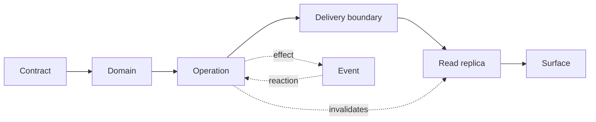

# Architecture Constitution

> **Purpose.** This skill defines the law that survives a stack swap.
> `tury-stack-backend-pattern` and `tury-stack-frontend-pattern` define how to
> write it in each stack. The `@turystack/*` libs are the source of truth for
> setup, options and public API. Nothing here replicates any of the three.

## Mental model



- **Contract** is the source of truth for types. Everything derives from it;
  nothing duplicates it.
- **Domain** protects business invariants and is the consistency boundary.
- **Operation** coordinates a unit of work and decides the consistency
  strategy.
- **Delivery boundary** translates transport and delegates. It never decides.
  Request, message, tick and **navigable address** are all the same thing here.
- **Event** announces an accomplished fact and decouples the effect from the
  main flow.
- **Read replica** — cache, read model, index — is derived and never
  authoritative. The write says what it invalidates (`ARC-18`).
- **Surface** is where someone consumes the result, and every remote result has
  five outcomes, not one (`ARC-20`).

The last two are in the diagram because that is where most of the frontend
lives — and where the constitution used to be silent. Nothing in them is
exclusive to UI: a read model and a third-party API consumer occupy exactly the
same nodes.

## The two halves

A Turystack product has two sides that **share contracts, not code**.

```text
frontend  ──── generated contract ────►  backend
          ◄─── error catalogue ────────
          ◄─── authz authority ────────
          ──── correlation id ────────►
```

Those four lines are **seams**: one contract, two ends. Each one has a declared
owner in sections `03`, `06`, `07` and `08`. A seam without an owner is how a
contract diverges without anyone noticing.

## Global invariants

| ID | Law | class |
|---|---|---|
| ARC-1 | A lower layer never imports a higher layer. | constitutional |
| ARC-2 | A module exposes its public surface through a barrel; an external consumer never reaches internals. | constitutional |
| ARC-3 | Organization by domain/feature; never by a global folder of technical type. | constitutional |
| ARC-4 | A specific helper stays with its owner; `support/` only when cross-use is real. | constitutional |
| ARC-5 | A typed contract is the single source of truth; never redeclared or copied downstream. | constitutional |
| ARC-6 | The delivery boundary is thin: it translates, validates shape and delegates. It does not decide. | constitutional |
| ARC-7 | Scope and ownership come from the authenticated context, never from a client field. | constitutional |
| ARC-8 | Every write declares its consistency strategy: transaction, compensation or event. | constitutional |
| ARC-9 | An error is never silent: logged once at the boundary with context, then rethrown or turned into feedback. | constitutional |
| ARC-10 | Secrets and PII never enter a log, span, metric, bundle or response. | constitutional |
| ARC-11 | Telemetry dimensions and attributes are low cardinality. | constitutional |
| ARC-12 | Asynchronous delivery is at-least-once and unordered: the handler is idempotent and commutative. | constitutional |
| ARC-13 | Every call that leaves the process has a timeout and a declared failure strategy. | constitutional |
| ARC-14 | Infrastructure covered by an owned lib is used directly; an integration without a lib sits behind an interface owned by the application. | constitutional |
| ARC-15 | Configuration is validated at boot and consumed through a typed service; no raw environment variable access in application code. | constitutional |
| ARC-16 | The shared config package is the source of truth for lint, format and TypeScript. | stack lint |
| ARC-17 | State that must survive a reload, a link or history lives in the navigable address, not in memory. | constitutional |
| ARC-18 | A read replica is derived, never authoritative: the write declares what it invalidates. | constitutional |
| ARC-19 | Untrusted data is neutralized at the output point, according to the destination interpreter. | constitutional |
| ARC-20 | A remote read has five outcomes — pending, empty, partial, error, success — and all of them are decided. | constitutional |

## Validation ladder

The same order on both sides. What changes is where each rung lives.

1. **Shape** of the input → schema at the boundary.
2. **Authentication and permission** → security boundary.
3. **Existence and ownership** → operation.
4. **Business rule** → domain.
5. **Persistence and integration** → repository, lib or adapter.

A rung is never repeated in the next rung. Revalidating shape inside the
operation is duplication, not defense.

## How to decide where a rule lives

```text
survives rewriting the product in another language?
├── yes → here
└── no  → it is stack mechanics
          ├── holds on both sides? → unlikely; check whether it is law
          └── holds on one side → backend-pattern or frontend-pattern
```

When in doubt, write the law here and the mechanism in the stack skill. Law
without mechanism is too abstract; mechanism without law becomes cargo cult.

## Conventions that are not law

Full, domain-oriented names. Early return, shallow nesting. `unknown` +
narrowing instead of a type escape. Independent operations in parallel, dynamic
batching with bounded concurrency. Named exports. A comment only when it records
a constraint impossible to express in code.

These are deliberately absent from the invariants table: they are habit, not
gateable law. They are here because the stack skill should not repeat each one.
